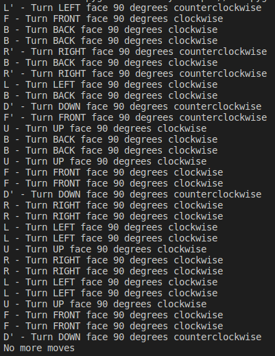

# Rubiks cube

Rubik's cube solver developed in Python, OpenCV & OpenGL/Pygame

## How to run

```
usage: main.py [-h] [-c]

options:
  -h, --help       show this help message and exit
  -c, --calibrate  Calibrate the colors.
```
## Color Calibration
To calibrate the colors follow the instructions in the top left corner.


You can select the color on the original camera image and/or adjust the limits as you wish.

When you are happy with the color calibration press __ENTER__ to calibrate the next color.

## Face and Color Detection
Start with the white face facing the camera and the green face on top.


Follow the instructions on the bottom left until every cube face is detected.

If you notice that any face was not detected correctly you can press __BACKSPACE__ to revert the last face scan.

## Solve the cube
Now that all faces were scanned you can solve the cube following the text instructions on the terminal or replicating the movements on the animated cube




Press __Enter__ or __Right Arrow__ to see the next move.

Press __Backspace__ or __Left Arrow__ to redo the last move.


URL for working rubik solver fork:
[rubik solver](https://github.com/robertofiguz/python-rubik)
